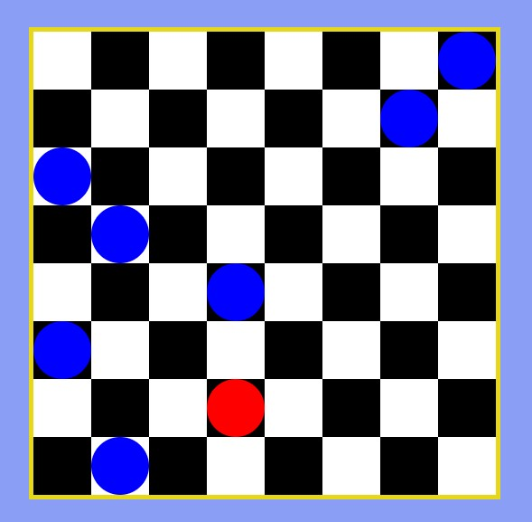
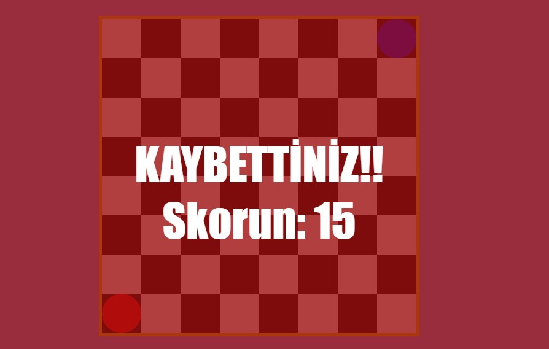

# One Red Lot of Blue
**Shotgun King- The Final Checkmate** temel dinamiklerini kullandığım oyundur
[Shotgun King ](https://punkcake.itch.io/shotgun-king)
 ise örnek aldığım oyunumun linkidir.

**One Red Lot of Blue**, HTML5 Canvas ile geliştirilmiş, görsel olarak dama oyunundan esinlenilmiş belirli zorluklara sahip sıra tabanlı oynanan bir oyundur. Oyuncu, kırmızı taş ile satranç tahtasının üstünden gelen mavi düşmanları yakalar ya da onları toplayarak puan kazanmaya çalışır.Oyunun kaybetme dinamiğinde ise düşmanlardan birinin 8*8 lik matrisi geçmesi vardır eğer mavi düşmanlar bu tarafa geçerse oyun biter!

##  Özellikler

- 8x8 grid üzerinde oynanır
- Her iki hamlede bir yeni düşman eklenir
- Arka plan müziği ve ses efektleri ile oyuncunun hamleleri seslendirilir
- Düşmanlarla çarpışma sonucu skor artar
- Düşman en alt satıra ulaşıp tahtanın dışına çıkarsa oyun biter ekranda toplam skor görülür

##  Nasıl Oynanır?

- Oyuncu: **Kırmızı taş** 
- Düşmanlar: **Mavi taşlar** 
- Amaç: Oyuncuyu kontrol ederek düşmanlara çarpıp yok ederek puan toplamak ve alt satıra ulaşmalarını engellemek.

### Kontroller:
Kareli 8x8'lik bir tahtada çapraz ve düz olmak üzere 8 farklı yöne hareket edebilirsiniz

 **← **  :Sola           
 **↑**   :Yukarı         
 **→**   :Sağa           
 **↓**   :Aşağı          
 **W**   :Sol Yukarı     
 **A**   :Sol Aşağı      
 **S**   :Sağ Aşağı     
 **D**   :Sağ Yukarı     

##  Kurulum
Aşağıdaki aşamaları takip ederek basit bir şekilde oynayabilirsiniz.
1. Dosyaları bilgisayarınıza indirin.
2. `index.html` dosyasını bir tarayıcıda açın.
3. Ok tuşları ya da W, A, S, D ile oynamaya başlayın!

Ya da 
**https://nurgull6872.github.io/one-red-lot-of-blue/** direkt bu siteden oynayabilirsiniz.

### Sesler

- **Müzik:** `loopmusic.mp3`
- **Düşman Yendi Sesi:** `win.wav`
- **Oyun Bitti Sesi:** `die.wav`
> **Not:** Seslerin otomatik oynatılması için kullanıcı etkileşimi gereklidir. Oyuncu klavyeden herhangi bir tuşa bastığında müzik başlar.

### Teknolojiler

- HTML + CSS **tarayıcı ekranı + stil ve düzenlemeler için**
- JavaScript ** oyunun temel dinamiği için**
- Canvas **grafik çizimleri için**

#### Oynanışı için ek notlar

- Oyuncumuz oyuna ilk olarak başlar.
- Her 2 hamlede bir yeni düşman eklenir.
- Oyuncu kırmızı daire düşmanı yemek ve puan kazanmak için mavi topları kendi tarafından uzak tutmaya çalışır.
- Düşman maviler matris şeklindeki ekranda y ekseninde bir kare olacak şekilde aşağı doğru hareket ederler.
- Oyuncu karşı tarafın bir sonraki hareketini de tehmin etmeye çalışarak mavi düşmanı yemeye çalışır.

- Ek olarak eğer oyuncumuz ikinci hareketini gerçekleştirip mavi düşmanı yemeye çalışacaksa mavi düşman bir alt satıra geçeceği için burada mavi düşmanın kaçma ihtimali bulunabilir
- Skor her düşman yok edildiğinde 1 artar.
- Oyun bittiğinde ekranın üstünde **"KAYBETTİNİZ!"** yazısı ve toplam skor belirir.

##### Dosya Yapısı
OneRedLotOfBlue/
│
|── index.html
|── game.js
|── music/
│ |── loopmusic.mp3
│ |── win.wav
│ |── die.wav
|── defeatekran.jpg
|── playekran.jpg

**oyunumun youtube tanıtım videosu linki**
[Tanıtım videosunu YouTube’da izlemek için tıklayınız.](https://www.youtube.com/watch?v=eMAcy58IOiQ)

**Keyifli oyunlar!**

